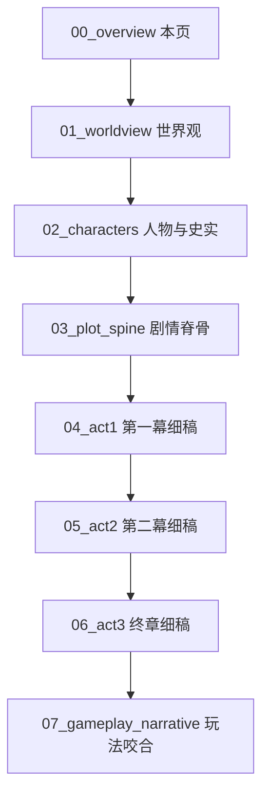

# 《末命》剧本细稿总览 · 0.0.2

> 美术定案：**水墨勾边 2D**（一、二幕）；三幕为同色温风格化短 3D。  
> 本文档包替代「仅有场次表」的粗稿，供人类与 Agent 共用。  
> 史实 / 民间 / 虚构 均会标注。**悲剧定轨不变。**

## 阅读顺序（建议）

| 文件 | 内容 |
|---|---|
| [01_worldview.md](01_worldview.md) | 世界观、气数、三层真实 |
| [02_characters.md](02_characters.md) | 朱由检补完、人物卡、关系图 |
| [03_plot_spine.md](03_plot_spine.md) | 大小节点、因果链、情绪曲线 |
| [04_act1_script.md](04_act1_script.md) | 王府场景、对白、经营叙事 |
| [05_act2_script.md](05_act2_script.md) | 朝堂议题戏、关键对白 |
| [06_act3_finale.md](06_act3_finale.md) | 破城、煤山、回忆 |
| [07_gameplay_narrative.md](07_gameplay_narrative.md) | 系统如何讲故事 |

旧场次索引现集中于 [`../../../docs/02_故事圣经.md`](../../../docs/02_故事圣经.md)（重制版），以本目录 **0.0.2 细稿为准**。

---

## 核心主题（升华后）

| 层 | 表述 |
|---|---|
| 表层 | 勤政的皇帝为什么救不了明 |
| 中层 | 正确的选择在崩溃系统里互相撕咬 |
| 深层 | **人把「尽责」当成赎罪，却用尽责加速了清算** |
| 玩家层 | 你留下的不是国运，是你辜负过谁的证据 |

终章句库（择一）：

- 「勤，未能救国。」
- 「正确，未能救人。」
- 「遗诏写给百姓；回忆留给你辜负过的人。」

---

## 独立游戏叙事手法借用（气质，不抄剧情）

| 作品 | 借什么 | 落在本作 |
|---|---|---|
| 《冰汽时代》 | 每一次「正确」都有人冻死 | 五资源互撕；无胜利 UI |
| 《请出示证件》 | 官僚按钮里的道德磨损 | 批红如盖章，旬旬麻木 |
| 《极乐迪斯科》 | 内在声音分裂自我 | 「君心」过高时 UI 出现急躁旁白 |
| 《Suzerain》 | 改革被结构吞没 | MandateDecay 只可延缓 |
| 《Spiritfarer》 | 温柔日常对照永别 | 第一幕种菜 ↔ 终章空畦 |
| 《这是我的战争》 | 平民代价入镜 | 流民、封门、民女瞬间 |
| 《Pentiment》 | 历史是被书写的 | 血诏 vs 玩家真实回忆 |
| 《哈迪斯》 | 关系在重复中加深 | 回忆碎片加权蒙太奇 |

---

## 标注图例（全文通用）

| 标记 | 含义 |
|---|---|
| **【史】** | 有正史/通行史书记载，文内给出处 |
| **【民】** | 民间杂谈、演义、通俗说法，戏剧采用 |
| **【虚】** | 本作虚构，服务主题 |
| **【戏】** | 史实骨架上的戏剧压缩或改写 |

---

## 一句话世界观

大明不是死于「皇帝不够勤」，而是死于 **人人都在用自己的正确，把漏船凿得更快**；朱由检以为硃笔能补漏，其实硃笔也是凿子。
