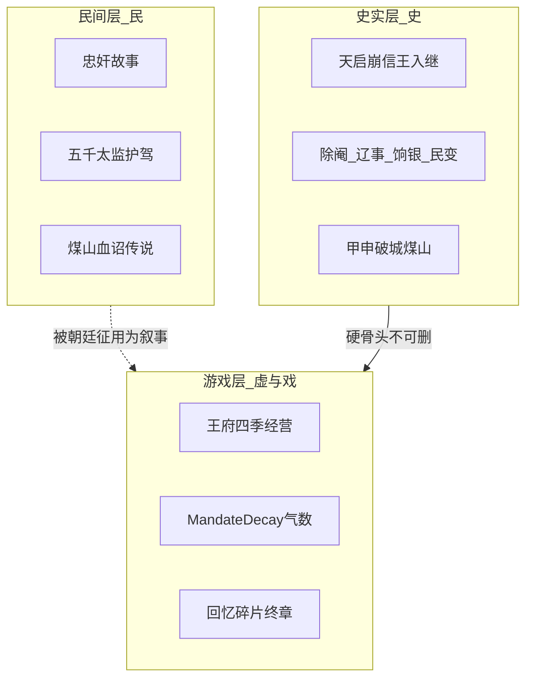
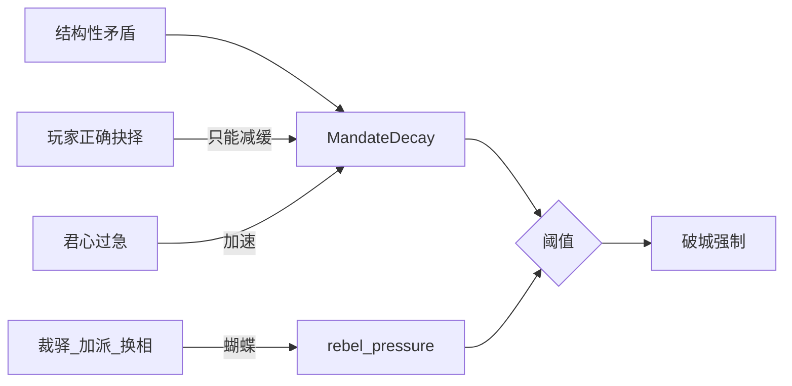

# 世界观 · 《末命》

## 三层「真实」

本作有意让玩家活在三层重叠的真实里——这是叙事引擎，不是考据竞赛。

- **史实层**：保证「这是明末」的可信骨架。  
- **民间层**：给戏剧张力和反讽（如「五千」变十余残卒）。  
- **游戏层**：把无力感做成可玩的系统。

---

## 「气数」在世界观里是什么

气数 **不是天命神迹 UI**，而是：财政、派系、边患、灾荒、皇帝性格绑在一起的「漏船计量器」。  
玩家越想「亲手修好每一处」，越容易在别处凿穿船板——主题可视化。

---

## 空间想象（水墨勾边 2D）

| 空间 | 视觉 | 听觉 | 叙事功能 |
|---|---|---|---|
| 信王府 | 纸色、菜畦、木门 | 丝竹、鸟 | 教会「过日子」与牵挂 |
| 御书房/朝堂 | 奏折、硃红、阴影立绘 | 笔、玺、低频 | 教会「尽责即伤害」 |
| 破城巷 | 烟、火、剪影 | 鼓噪→渐静 | 把抽象国势变成肉身 |
| 煤山 | 绳、树、星 | 风、心跳 | 仪式与审判 |

---

## 时间规则（戏剧时间）

| 幕 | 时间感 | 说明 |
|---|---|---|
| 一 | 2–4 个「游戏年」 | 【戏】压缩；真实信王就藩到入继更短促，此处为经营可玩 |
| 二 | 按「旬」与阶段 B0–B6 | 【戏】年表折叠；议题戏剧优先 |
| 三 | 破城当日前后 | 【史】甲申之变骨架 |

---

## 世界观关键词

**末命**：不是「最后一道命令」而已，而是——  
你被赋予的那道「必须救国」的命令，本身就是绞索。

**谷种母题**【虚】：阿恩在夜召时塞给你的王府旧谷种。  
它在第二幕偶尔被提起，第三幕可掉落/丢失，终章回忆里变成空畦或发芽——取决于你是否还记得「园子里的人」。
