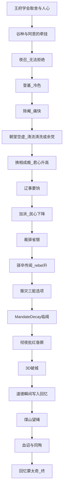
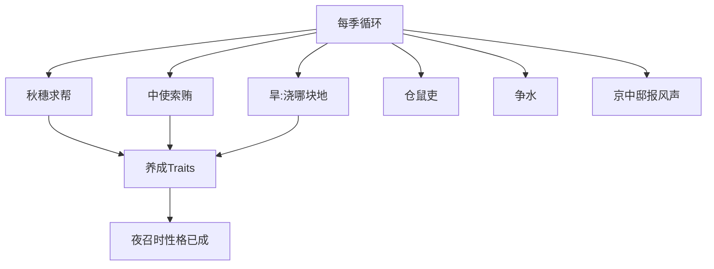
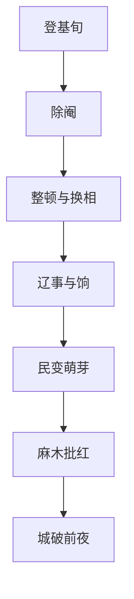

# 剧情脊骨 · 大小节点与因果链

## 情绪总曲线

---

## 因果总链（环环相扣）

> 每一环都要能回答：「若删掉上一环，下一环还成立吗？」

**定轨钉**：A3、B10→C1、C4–C6 不可被玩法跳过。

---

## 大节点（Must Beat）

| ID | 幕 | 大节点 | 玩家感受 | 系统后果 |
|---|---|---|---|---|
| MB01 | 1 | 第一畦菜 | 「我会过日子」 | 可生成 MF_FIRST_HARVEST |
| MB02 | 1 | 阿恩夜谈谷种誓 | 被托住 | 情感锚 |
| MB03 | 1 | 中使夜召 | 失控的开始 | 强制 Act2 |
| MB04 | 2 | 除阉抉择 | 痛快或恶心 | 朝堂结构变 |
| MB05 | 2 | 督师与辽饷 | 名将陷阱 | 边/民互撕 |
| MB06 | 2 | 裁驿 | 省银的骄傲 | rebel 永久修正 |
| MB07 | 2 | 开仓或严剿 | 脏手 | 高权重回忆 |
| MB08 | 2 | 城破前夜昏厥 | 奏折未完 | 强制 Act3 |
| MB09 | 3 | 「五千」反讽 | 叙事撒谎 | 主题 |
| MB10 | 3 | 活门/民女 | 具体的人 | 回忆 |
| MB11 | 3 | 望绳上吊 | 仪式 | 终章 |
| MB12 | 3 | 回忆蒙太奇 | 刺痛 | 结束 |

---

## 小节点示例（可随机/可跳，但要服务因果）

### 第一幕小节点池

### 第二幕阶段大节点

| 阶段 | 必出议题/戏 | 可选小危机 |
|---|---|---|
| B1 | 魏忠贤 | 厂卫善后 |
| B2 | 换相、清流清算 | 言官交章 |
| B3 | 督师、辽饷 | 哗变、反间 |
| B4 | 裁驿、赈灾 | 江南抗税、蝗、流民营 |
| B5 | 频换、边警 | 彻夜批红、又撑过一冬 |
| B6 | 后宫安危、昏厥 | — |

---

## 「逻辑可循」写作守则

1. **信息先落点**：魏忠贤名字必须在一幕邸报出现，二幕才能对峙。  
2. **道具回收**：谷种、第一畦菜、秋穗、裁驿，必须在终章有机会回声。  
3. **选择有疤**：每个脏选项生成回忆标题；干净选项也要付代价（银、边、秩序）。  
4. **禁止无因果跳跃**：不可无铺垫直接「李自成打进门」；必须经过 rebel_pressure / 灾荒 / 裁驿至少二线痕迹。  
5. **定轨不骗玩家**：教程与 Steam 页写明悲剧定轨；「无解」是主题不是 bug。

---

## 故事大纲（一页纸）

少年信王在暖色王府学会种地、取舍与牵挂；夜召入宫后，他以除阉开启勤政神话，却在换相、辽饷、裁驿与赈灾的正确撕咬中耗尽气数。破城夜，传说中的五千护驾只剩残卒；他在煤山留下给百姓的遗诏，回忆却逐一点名他辜负过的人。  
**国未因他懒惰而亡，却因他太想用一人之勤，代替一个失效的世界。**
