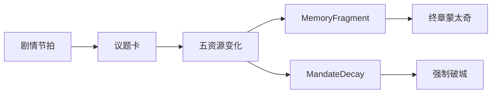

# 玩法 × 叙事咬合

## 设计原则

**每条资源都是一句台词；每次批红都是一场微型道德剧。**



---

## 系统如何服务主题

| 系统 | 主题翻译 |
|---|---|
| 五资源互斥 | 正确与正确互撕 |
| 君心过高 | 勤政成瘾=伤害 |
| MandateDecay 不可清零 | 结构大于个人英雄 |
| 无胜利 UI | 定轨诚实 |
| 回忆碎片 | 玩的是愧疚不是通关 |
| 第一幕经营 | 先给人，再给人变数字 |

---

## 第一幕经营的叙事任务

不是模拟农场赢，而是：

1. 建立「具体的人」（阿恩、秋穗）  
2. 练习取舍（为二幕残酷选择题热身）  
3. 产出 Traits，使二幕台词分叉  
4. 埋谷种母题  

---

## 第二幕回合的叙事节奏

```text
看国势（压力）→ 读议题（冲突）→ 批红（伤害）→ 旁白一句（主题）→ 下一旬
```

每 4–6 旬应有一次「承恩劝歇」或「又撑过一冬」，防止纯数值麻木。

---

## 水墨勾边 2D 下的信息表达

| 元素 | 做法 |
|---|---|
| 资源危险 | 色带黄红 + 墨晕扩散，少用现代霓虹 |
| 议题卡 | 仿奏折；选项如硃批条 |
| 回忆解锁 | 墨点落纸的一小动画 |
| 夜召 | 暖黄纸突然被冷青罩住 |

---

## M1 垂直切片建议范围（回家开发）

可玩即可，不求三年：

1. 王府一小图：种、收、卖  
2. 阿恩两场戏  
3. 一个轻危机  
4. 夜召演出到黑屏  

细稿对白已在 `04_act1_script.md`，程序按场 ID 挂接即可。
