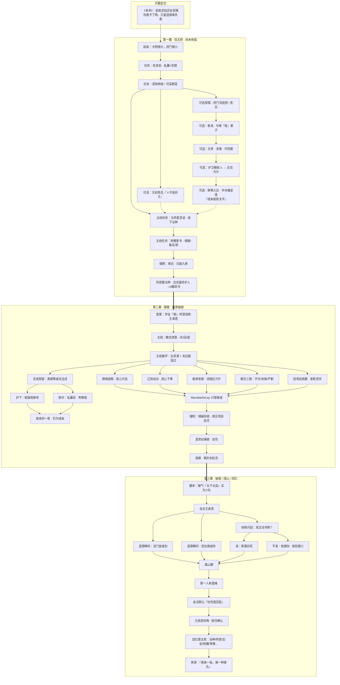
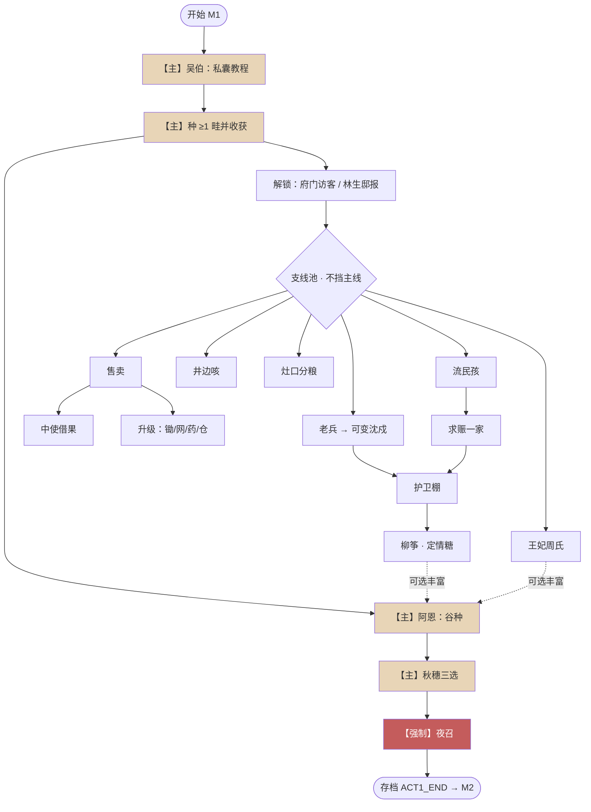
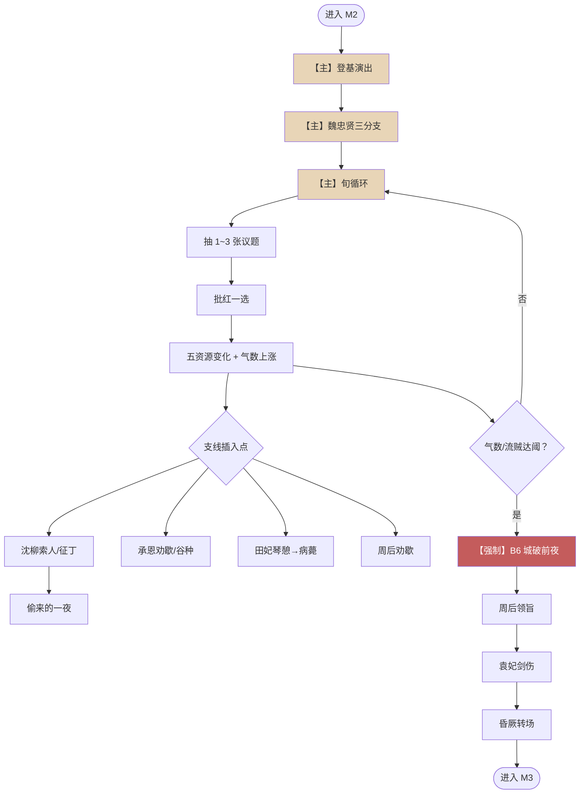
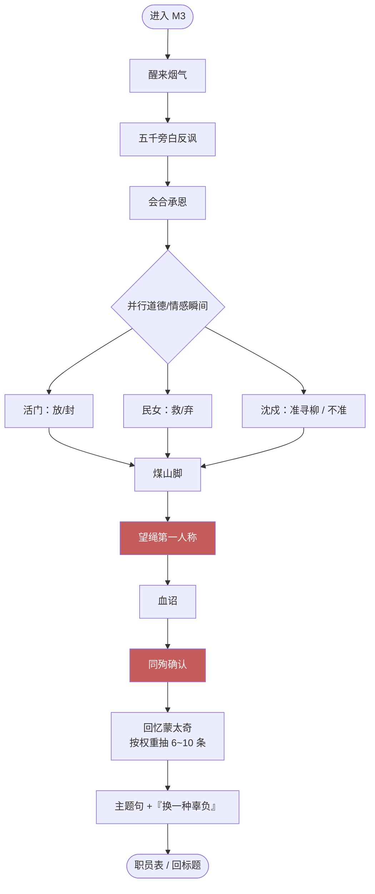
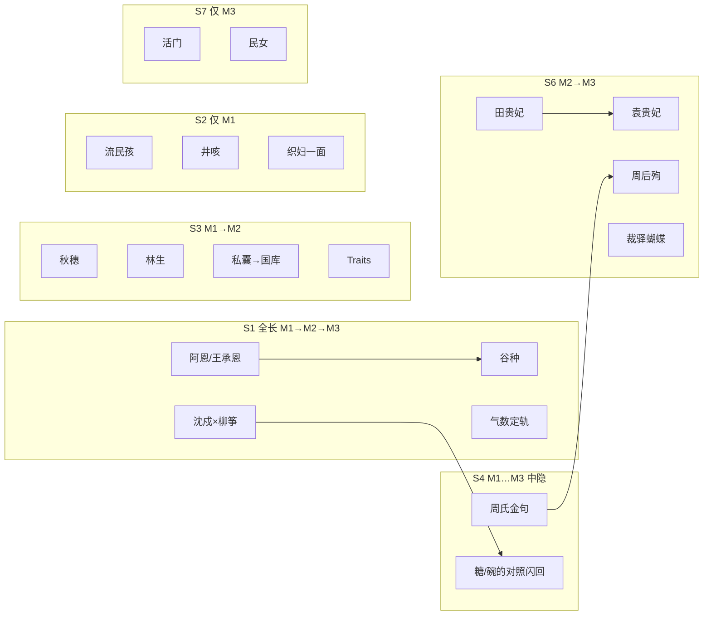
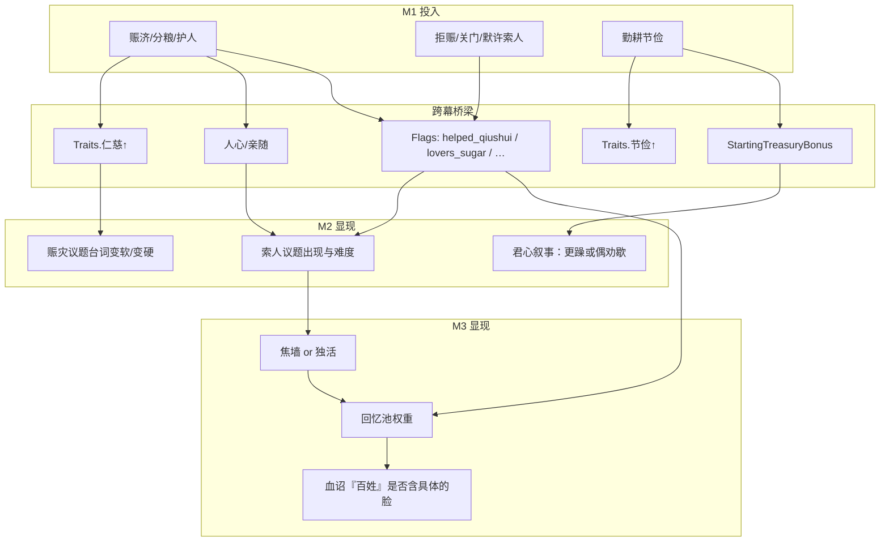

# 《末命》剧情总流程图 · 跨度 · 支线挂点

> 读完本文 + 图，应能回答：**这游戏讲了什么、主线怎么走、支线何时插、谁影响谁。**  
> 定轨不变：无论支线怎么选，**终局核仍是煤山**；差异在过程、代价与回忆。

---

## 〇、一句话故事

少年信王在府里学会「人不是折子」→ 夜召入宫成崇祯 → 勤政批红却越救越乱 → 城破 → 煤山自尽；回忆里闪过阿恩、后妃、秋穗式百姓、以及沈戍与柳筝那对活不成的鸳鸯。

---

## 一、剧情跨度类型（七种）

用于给**每条人物/事件线**打标签，避免所有线都强行贯三幕。

| 代号 | 跨度 | 含义 | 本作主用线 |
|---|---|---|---|
| **S1** | M1→M2→M3 | 全长主情感 | **阿恩**；**气数/定轨**；**沈戍×柳筝**；**谷种母题** |
| **S2** | 仅 M1 收束 | 府门一面，只留回忆刺 | 流民孩、井边咳、织妇（若未留府）、部分中使借果余波 |
| **S3** | M1→M2 | 王府种因，朝堂结果 | **秋穗**（家书→赈灾议题影子）；**林生邸报**→言路；**私囊结余**→国库初值 |
| **S4** | M1 起，M2 隐，M3 再显 | 中段不刷脸，终章闪回 | **王妃周氏金句「人不是折子」**；阿恩糖/鸳鸯糖的对照；某次拒赈的脸 |
| **S5** | 仅 M2 收束 | 朝堂内闭环 | 单次换相空洞、部分盐法/密报议题（无三幕闪回也可） |
| **S6** | M2→M3 | 御极种因，破城收割 | **田贵妃病薨**；**袁贵妃剑伤**；**周后领旨**；裁驿→流贼压力 |
| **S7** | 仅 M3 | 破城当场道德瞬间 | 活门放/封、民女救/弃（可无前史） |

### 跨度选用原则

1. **S1 不超过 4 条**（阿恩、定轨、鸳鸯、谷种），防止主线被情感线撑爆。  
2. 府门 vignette 默认 **S2**；只有明确「留下的人」（柳筝、沈戍）升格。  
3. 后妃：**周=S1 弱贯穿（一幕有、二幕劝歇、三幕必闪）**；田/袁以 **S6** 为主。  
4. 凡标 S2/S5/S7 的线：**允许玩家错过**，不挡夜召/破城/煤山。

---

## 二、主线任务脊骨（玩家必做）

```text
【M1 主线】私囊教程 → 种收 → 阿恩谷种 → 秋穗家书 → 夜召入宫
【M2 主线】登基 → 除阉 → 换相/辽饷/裁驿/赈灾循环 → 气数临界 → 昏厥
【M3 主线】破城短关 → 煤山望绳 → 血诏 → 同殉 → 回忆蒙太奇
```

支线全部挂在主线节点的「两侧」，用虚线插入；**实线 = 主线不可断**。

---

## 三、支线出现节点表（穿插规则）

| 主线节点 | 可插入支线 | 跨度 | 对主线影响（有则写） |
|---|---|---|---|
| M1 首获后 | 府门孩/兵、林生邸报解锁 | S2 / S3 | 无；只攒人心/Traits |
| M1 首卖后 | 中使借果 | S2 | 拒→日后禄米慢的阴影（flag）；给→私囊损 |
| M1 天旱后 | 求赈；开药圃更值 | S2→可升 S1 | 赈/留人→人心、可触发沈戍/柳筝 |
| M1 护卫棚 | 收人、沈戍头目 | S1 | 亲随数；夜召护府对白 |
| M1 灶口 | 分粮；柳筝定情 | S1 | 鸳鸯糖记忆；人心 |
| M1 阿恩谷种后 | 阿恩糖（可选再谈） | S4 | 终章可闪；不挡秋穗 |
| M1 秋穗后 | （收敛）准备夜召 | — | Traits 影响二幕赈灾语气 |
| M2 登基 | 周后一句；阿恩改名 | S1/S4 | 冷色定调 |
| M2 除阉后 | — | — | 清流/空虚，换相更频 |
| M2 旬循环中 | 沈柳索人；秋穗式文书 | S1/S3 | 护鸳鸯耗银/秩序；拒则沈戍心死仍效力 |
| M2 田薨前后 | 承乾宫空 | S6 | 君心更躁（resolve↑叙事） |
| M2 B6 | 周后自尽；袁妃剑 | S6 | 强制；进三幕 |
| M3 活门/民女 | S7 道德瞬间 | S7 | 只改回忆权重 |
| M3 煤山前 | 准/不准沈戍寻柳 | S1 | 互斥悲剧记忆；不改定轨 |

### 支线影响主线的「硬规则」

| 影响类型 | 例子 | 允许幅度 |
|---|---|---|
| **改数值起点** | M1 私囊→M2 国库加成有上限 | 小 |
| **改选项台词/unlock** | 高仁慈→开仓多一句；护过柳筝→沈戍索人时多选项 | 中 |
| **改回忆池** | 拒赈/焦墙/空筝囊 | 大（终章观感） |
| **改定轨终点** | — | **禁止** |

---

## 四、总览故事流（一张图读懂主故事）



---

## 五、主线放大：任务级流程（M1）



---

## 六、主线放大：任务级流程（M2）



---

## 七、主线放大：任务级流程（M3）



---

## 八、人物线跨度总图（谁走哪种长度）



---

## 九、支线 → 主线影响图（因果）



---

## 十、推荐游玩时序（设计意图，非强制）

```text
上午感：吴伯 → 种 → 周氏一句 → 门前一面苦难
午后感：卖 → 中使刺一下 → 旱/赈 → 收人 → 看见沈柳
薄暮感：阿恩谷种（主线钉）→ 秋穗抉择（主线钉）
夜：召
```

支线再多，也必须在「薄暮感」前把玩家推回 **阿恩→秋穗**；目标条优先级应如此排序。

---

## 十一、与文档索引

| 文件 | 用途 |
|---|---|
| 本文 | 总流程、跨度、挂点、影响 |
| `03_剧情脊骨.md` | 更短的因果链 |
| `04/05/06_act*_script.md` | 分幕对白 |
| `09_后妃线.md` | 后妃 |
| `10_护卫鸳鸯.md` | 鸳鸯 |
| `08_时局小故事.md` | M1 事件清单 |
| `06_回忆碎片.md` | 终章抽卡 |

---

## 十二、一句话验收

若只看第四节总览图，应能复述：

> 王府烟火与取舍 → 夜召称孤 → 除阉后越勤越乱 → 后妃与小人物都被碾碎 → 煤山定轨；支线只改变你辜负过谁的证据，不改变绳。
