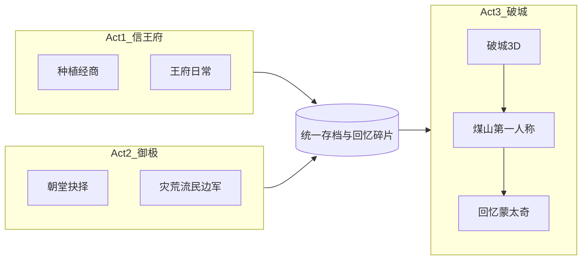

# 《末命》定位与愿景

> **作者：Sakura <1124114910@qq.com>**  
> 全案规划：三大幕完整规划（2026-08）· 细稿入口 [`story/00_剧本总览.md`](story/00_剧本总览.md)

---

## 一、作品定位

| 项 | 定案 |
|---|---|
| 中文名 | 《末命》（副标题可：最后的诏命） |
| 英文名 | Last Mandate |
| 平台 | PC / Steam |
| 语言 | 简体中文（UI、剧情、字幕一体；英文化可后补） |
| 核心体验 | **悲剧定轨**：无论怎么玩，终将走向煤山；玩家改变的是「你曾怎样努力、牺牲了谁、回忆里留下什么」 |
| 类型混合 | 模拟经营 + 资源规划 + 叙事抉择 + 后期短程 3D 沉浸 |
| 气质对标（非抄玩法） | 前期《星露谷物语》/《动森》；中期《冰汽时代》；后期强氛围 3D 小品；终章短第一人称 |

**与市面 AI 历史模拟器的差异**：本作**不依赖大模型**，用脚本事件树 + 数值系统保证可发售、可维护、零 Token 成本；卖点是「视角与气质的三次变奏」和「定轨悲剧的余韵」。

**一句话卖点**：你在王府种过菜、在朝堂做过不可能的选择题，最后仍要自己走向那根绳子——而绳子上挂着的，是你亲手写下的回忆。

---

## 二、主题三句（贯穿全作）

1. **你越想掌控，越失去所能掌控的。**
2. **善意与正确，在系统崩溃时可以互相撕咬。**
3. **遗诏写给百姓，游戏却让你先记住自己辜负过谁。**

---

## 三、终章思辨点（导演阐述）

- 勤政是否等于善治？
- 杀奸臣之后，空虚由谁填满？
- 遗诏里的「百姓」，是否包括你为筹饷逼反的那些人？
- 玩家若感到愤怒「为什么无解」，愤怒本身就是主题。

---

## 四、历史态度

- **硬骨头（不可乱改）**：天启崩、信王入继；清除魏忠贤；勤政急躁与频换大臣；辽事/饷银/驿递/民变；李自成进京；煤山自缢；王承恩同殉。
- **可改编（服务游戏）**：王府年限压缩为可玩四季；官员政策人格化；民间传说升格为终章仪式；「五千太监护驾」作戏剧夸大与反讽。
- **明确不做**：真·中兴通关；改写天命的胜利结局。
- 启动注明：历史戏说；悲剧命运为设计选择。

---

## 五、引擎与技术架构

| 引擎 | 定案 |
|---|---|
| **Godot 4** | 永久免费（MIT）；2D/3D 同工程；个人可完成体量 |

**架构原则**：

- 三大幕共用「存档 / 人物关系 / 回忆碎片」数据层。
- 换视角 = 换场景与输入，不换存档灵魂。
- 第一幕：**3D 俯视**经营（重制方向；全案原 2D 已归档）。
- 第二幕：朝堂议题 + 五资源（UI 如奏折仪表盘）。
- 第三幕：短 3D 破城 + 煤山第一人称 + 回忆蒙太奇。
- 所有关键抉择写入 `MemoryFragment`，供终章蒙太奇调用。



---

## 六、情绪总曲线

```text
暖日常 → 夜召不安 → 登基亢奋 → 除阉痛快 → 越改越乱 → 麻木批红
→ 城破窒息 → 煤山寂静 → 回忆刺痛 → 余韵留白
```

— 作者：Sakura <1124114910@qq.com>
