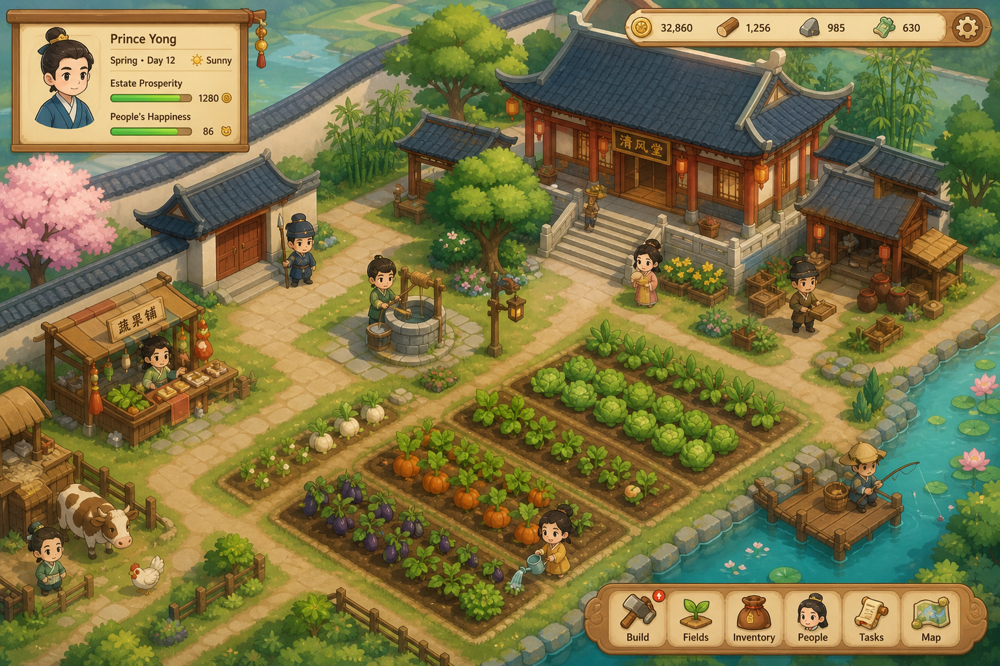
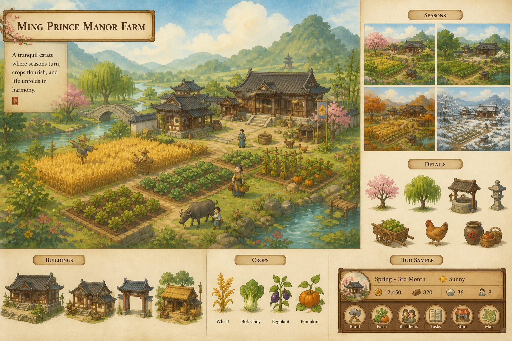
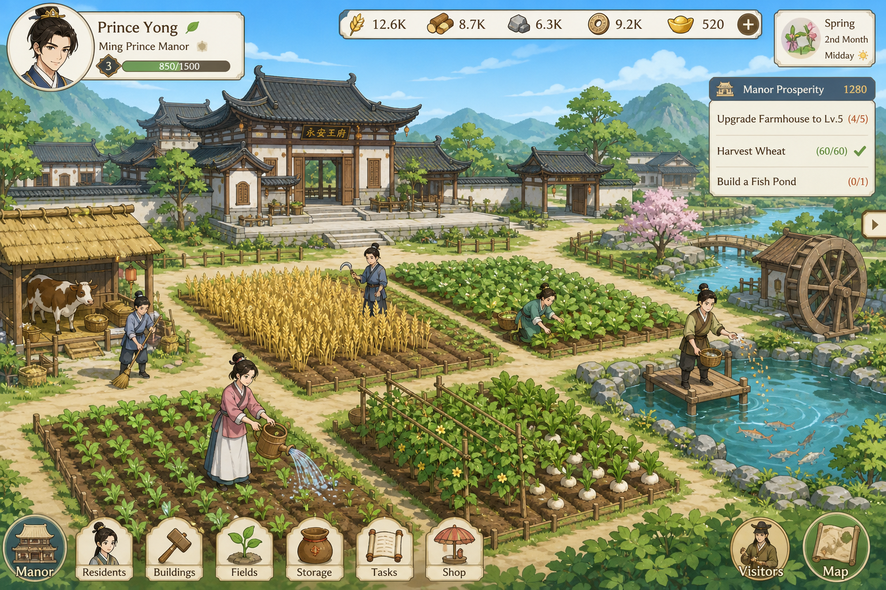
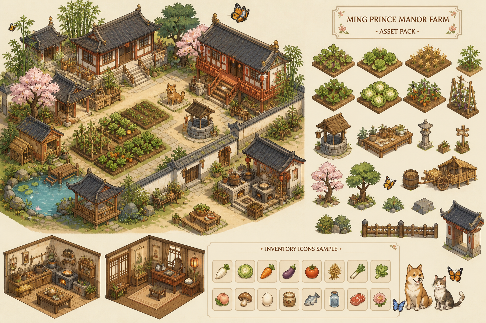

# 《末命》M1 画面风格选项（请你拍板）

> 对标热门 **非像素** 2D 经营气质（星露谷式「过日子」可读性、牧场物语式暖色、灵魂摆渡人式 vignette 氛围），**不做像素**。  
> 公司网常下不了 itch：请在**家里**按选定风格下载对应包，放到表内路径后说「素材已放好」，再统一挂接。

样张目录：`docs/art/style_boards/`

---

## 四选一（看图说话）

### A · 柔和商业卡通（当前工程最接近）

| 项 | 内容 |
|---|---|
| 气质 | 热门独立经营「干净可读」：软边、圆润、暖色、剪影清楚 |
| 对标感觉 | 星露谷的舒适感（但非像素）、部分 mobile cozy sim |
| 免费可商用包 | [Great Farm](https://oddblotstudios.itch.io/free-the-great-farm-isometric)（Oddblot，可商用勿转卖）+ 工程现有程序柔和绘制过渡 |
| 放到 | `game/assets_library/vendor/oddblot/great_farm/` |
| 优点 | 与现工程衔接最快；UI 好做木牌/圆角 |
| 风险 | 手绘包与程序剪影要统一一轮色 |

### B · 绘本手绘暖色

| 项 | 内容 |
|---|---|
| 气质 | 故事书笔触、纸感、暖光；适合悲剧主题下的「温柔反差」 |
| 对标感觉 | 绘本 / Spiritfarer 式情感（气质参考，不抄） |
| 免费可商用包 | [Basic Hand-Drawn Tileset](https://schwarnhild.itch.io/basic-hand-drawn-tileset-and-asset-pack)（**需署名 schwarnhild**） |
| 放到 | `game/assets_library/vendor/schwarnhild/hand_drawn_v01/` |
| 优点 | 叙事气质强，和「人不是折子」贴 |
| 风险 | 笔触重，UI/立绘要同一套笔触，工作量略大 |

### C · 清爽赛璐璐动画风

| 项 | 内容 |
|---|---|
| 气质 | 平涂、清晰描边、春绿干净，角色更「立得住」 |
| 对标感觉 | 日式轻经营 / 视觉小说农场感 |
| 免费可商用包 | 角色向可找 itch「hand-drawn top down characters CC0」类；地表仍配 Hand-Drawn / Great Farm 改色 |
| 放到 | `vendor/` 下按作者分子目录 |
| 优点 | 人物表情与后妃/鸳鸯线更好演 |
| 风险 | 纯免费完整一套难凑齐，可能要「地表手绘 + 角色自制/CC0」混搭 |

### D · 暖色等轴手绘农场包风

| 项 | 内容 |
|---|---|
| 气质 | 等轴/近等轴手绘菜与道具，烟火气强 |
| 对标感觉 | itch 手绘农场包成品感 |
| 免费可商用包 | **首选 Great Farm（Oddblot）**；可补同色温 props |
| 放到 | `game/assets_library/vendor/oddblot/great_farm/` |
| 优点 | 菜、道具最像「经营游戏」 |
| 风险 | 相机若保持顶视，等轴素材要微调摆放或改半等轴场景 |

---

## 明确不选（避免踩坑）

| 类型 | 原因 |
|---|---|
| 16×16 / 32×32 像素包 | 你已否决像素主风格 |
| Farm Valley **免费版** | 注明 **仅非商用**；商用需付费 Premium |
| 来路不明网盘包 | 许可不清，Steam 风险 |

---

## 声音（各风格通用，已进工程）

| 类 | 路径 | 状态 |
|---|---|---|
| 动效 / 天气 / 环境 | `game/assets/audio/` | 已有占位 WAV，可换正式包 |
| 推荐免费音源 | [Kenney Interface/Audio](https://kenney.nl/assets)（CC0）、[OpenGameArt](https://opengameart.org/) 搜 farm ambience（核许可） |

UI：一幕继续「木牌 + 布条」；风格 A/D 最贴；B 用纸边框；C 用细描边条。

---

## 请你回复一句即可

例如：

- `选 A`  
- `选 D，音效用 Kenney`  
- `选 B，署名我接受`

选定后我会：把对应包挂进 `models/`、改地表/道具/HUD 色板，并冻结一版 `archive/art_audio/`。
