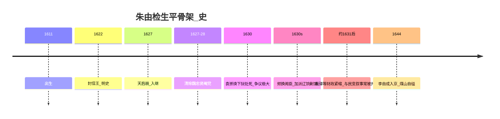
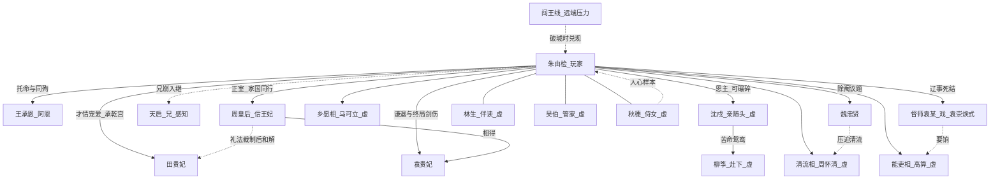

# 人物志 · 朱由检补完与关系网

## 朱由检是谁？（给不熟历史的你）

### 速写

朱由检（1611–1644），明朝倒数第二位皇帝，年号**崇祯**（庙号思宗等后议，游戏内称崇祯即可）。他不是「哥哥主动禅让」的童话继承人，而是在兄长天启帝死后，以信王身份入继大统的年轻皇帝：勤政、节俭、多疑、急于求成，在辽东战争、内地民变与朝党倾轧中把「换人」当成治理，最终甲申年北京陷落，自缢煤山。

### 生平要点（史实骨架）

| 事件 | 标记 | 出处 / 说明 |
|---|---|---|
| 封信王、天启七年八月即位 | 【史】 | 《明史》卷二十三《庄烈帝本纪》 |
| 天启好木工、权柄旁落魏忠贤 | 【史】 | 《明史》魏忠贤传；通行明史叙述 |
| 崇祯<{魏忠贤，忠贤自尽/被诛相关结局 | 【史】 | 《明史》；具体月份细节以本纪/传为准 |
| 「哥哥让位」 | 【民】【戏】 | 通俗说法；史实为兄崩弟继。游戏用「病重夜召」表达玩家感知 |
| 勤政、批红至夜、生活相对节俭 | 【史】【戏】 | 明清笔记与《明史》形象；游戏强化为「君心」机制 |
| 频换内阁大学士 | 【史】 | 《明史》宰辅表可见更迭之密；游戏做成换相议题 |
| 杀袁崇焕 | 【史】 | 《明史》袁崇焕传；后世纪「自毁长城」评价偏【民】【戏】 |
| 裁减驿递 | 【史】【戏】 | 崇祯朝确有驿递整顿/裁省；「裁驿逼出李自成」是通俗因果链，史学有争议——游戏保留蝴蝶，标注【民】张力 |
| 李自成由驿卒而起 | 【民】【戏】 | 通行通俗史叙事常见；严谨史学对其早期经历有异说。本作作「传闻→压力」 |
| 王承恩随殉煤山 | 【史】【民】 | 《明史》及明清记载有王承恩殉死叙述；细节多演义色彩 |
| 「五千太监护驾」 | 【民】 | 民间/演义夸大；游戏开场旁白夸大，实为一小队【虚】反讽 |
| 衣襟血诏「勿伤百姓」类遗言 | 【民】【戏】 | 流行叙事版本不一；本作默认「勿伤我百姓」，可选手改 |

### 人物性格（游戏可用）

| 侧面 | 来源感 | 玩法对应 |
|---|---|---|
| 想亲力亲为 | 【史】勤政形象 | 彻夜批红、君心↑ |
| 多疑 | 【史】厂卫余悸+边事反间 | 密报议题、督师线 |
| 恨阉党又离不开权术结构 | 【史】【戏】 | 魏忠贤「毒与药」 |
| 对「名将承诺」既渴又妒 | 【戏】 | 五年平辽式议题 |
| 王府日子里学过稼穑 | 【虚】 | 第一幕经营→赈灾台词变化 |

### 弧光（三幕）

---

## 人物关系总图

---

## 角色卡

### 王承恩 / 阿恩 【史】名 + 【虚】王府线

| 项 | 内容 |
|---|---|
| 功能 | 唯一贯穿三幕的「人」；忠诚不是愚忠，是记得你曾是园子里的少年 |
| 一幕 | 小黄门阿恩：端水、抬缸、夜谈 |
| 二幕 | 劝歇、提谷种；你越勤，他越安静 |
| 三幕 | 护驾；煤山同殉 |
| 关键句 | 「王爷若饿，园子里有菜。」→「皇上，谷种……还在。」→「奴婢陪皇上去。」 |

### 魏忠贤 【史】

| 项 | 内容 |
|---|---|
| 功能 | 毒与药；杀之痛快，留之恶心，囚之尴尬 |
| 戏剧 | 他对你说的不是求饶，是「外廷那些人，比奴才干净吗？」 |
| 出处 | 《明史》卷三百五 |

### 周怀清 【虚】清流相

东林余韵式直言。推动除阉、清议；实操不足时会把「道德正确」推成政治清洗。  
**主题功能**：让玩家体验「站在正义一边」如何制造空衙。

### 高算 【虚】能吏相

会筹饷、会办差。每个方案都要银子与权柄。短期有效，长期结怨。  
**主题功能**：善意的技术官僚。

### 马可立 【虚】乡愿相

圆滑、不做事也不出事。换相后的填充物。  
**主题功能**：你越换人，越只能换到他。

### 督师袁某 【戏】（袁崇焕式）

| 项 | 内容 |
|---|---|
| 功能 | 「五年」承诺 vs 辽饷 |
| 史实锚 | 袁崇焕督辽、获罪被杀 【史】《明史》本传 |
| 游戏名 | 默认「督师袁某」，避免考据战；可选显示全名 |

### 林生 【虚】

伴读。邸报入口。后来可入仕为小御史——若你第二幕整死言路，他会以回忆碎片「缺席」的方式出现。

### 吴伯 【虚】

管家。教程。象征「把日子过明白」。

### 秋穗 【虚】

侍女。娘家灾荒求帮。她是「具体的百姓」；遗诏里的百姓若不含她，主题成立。  
**不是**情爱线；勿写成后妃替代。

### 周皇后（信王妃周氏）【史】

| 项 | 内容 |
|---|---|
| 功能 | 正室与「家」；爱是并肩，也是因国事起的争执 |
| 一幕 | 信王妃：园中同行，提醒「人不是折子」 |
| 二幕 | 劝歇；与田贵妃礼法冲突后和解；甲申奉旨自尽 |
| 三幕 | 蒙太奇高频：递巾、阖户领旨 |
| 详稿 | [`09_后妃线.md`](09_后妃线.md) |

### 田贵妃 【史】

| 项 | 内容 |
|---|---|
| 功能 | 乱世喘息；才艺受宠；病逝后加速君心空洞 |
| 一幕 | 不出场（尚未入宫） |
| 二幕 | 承乾宫抚琴、礼法风波、病薨 |
| 三幕 | 空琴囊闪回 |
| 详稿 | [`09_后妃线.md`](09_后妃线.md) |

### 袁贵妃 【史】

| 项 | 内容 |
|---|---|
| 功能 | 谦退、与周后相得；终局「绳绝 + 剑伤」——来不及的温柔 |
| 出场 | 主要在二幕末与终章回忆 |
| 详稿 | [`09_后妃线.md`](09_后妃线.md) |

### 沈戍 × 柳筝 【虚】苦命鸳鸯

| 项 | 内容 |
|---|---|
| 功能 | 小人物虐恋；把「亲随」落成会爱人的脸；终章必悲剧 |
| 一幕 | 庄客头沈戍 + 灶下柳筝；定情半块糖；夜召他留下护府 |
| 二幕 | 内卫差遣；索人／征丁撕扯；偷来的一夜 |
| 三幕 | 护驾 vs 救她；焦墙同死或阴阳两隔 |
| 详稿 | [`10_护卫鸳鸯.md`](10_护卫鸳鸯.md) |

### 闯王线 【史】其人 + 【民】路径

李自成 【史】存在；驿卒起源 【民】【戏】。本作几乎不出脸，只用：传闻→流民→鼓噪→破城压力。

### 天启帝朱由校 【史】

| 项 | 内容 |
|---|---|
| 游戏出场 | 不正面长线互动；病重、大行、中使 |
| 民间 | 「木匠皇帝」【民】【史】有所本 |
| 戏剧 | 你继承的不是禅让，是烂摊子与恐惧 |

---

## 关系张力矩阵（写作时用）

| 关系 | 一幕 | 二幕 | 三幕 |
|---|---|---|---|
| 你—阿恩 | 依赖与温暖 | 忽视与愧疚 | 同赴 |
| 你—周后 | 园中尚能温柔 | 劝歇失败；赐死 | 蒙太奇高频 |
| 你—田妃 | — | 承乾宫喘息；病逝 | 空琴囊 |
| 你—袁妃 | — | 谦退背景；B6 剑伤 | 血腥短闪 |
| 你—清流 | 风声中的正义 | 清洗或失望 | — |
| 你—能吏 | — | 用他们的刀割民 | — |
| 你—督师 | — | 信/疑/杀 | 回忆刺痛 |
| 你—秋穗式百姓 | 可帮可不帮 | 变成数字 | 封门时再见 |
| 你—沈戍／柳筝 | 恩人与见证 | 可护可弃 | 必悲剧收场 |

---

## 虚构人物使用原则

- 阁臣三原型足够支撑「换相空洞」，不必堆砌真实名单。  
- 真实姓名仅用于：**魏忠贤、天启、崇祯本人、周皇后、田贵妃、袁贵妃、袁崇焕式督师（可化名）、李自成远端、王承恩**。  
- 后妃情爱线详见 [`09_后妃线.md`](09_后妃线.md)；不另造史外情人。  
- 凡【虚】角色，不在启动画面写「改编自真实人物」。
