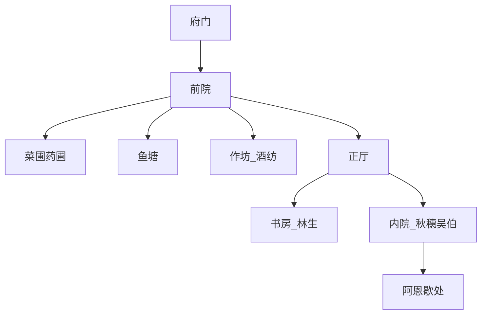

# 第一幕细稿 · 信王府「尚未称孤」

> 气质：暖纸色柔和卡通；《星露谷》式日常 + 偶发宫廷冷风。  
> 强制出口：夜召。

---

## 空间场记

**开场镜头建议**：晨雾中一畦菜，少年蹲着拔草；画外是京城远鼓——远，但在。

---

## 节拍表（默认三年，可缩）

### 序：两场必须戏

#### 场 A1-PRO-01 · 日出 【虚】

- **场景**：菜圃。露水。  
- **动作**：玩家学会移动、互动。  
- **旁白**：「大明很大。府门很小。你暂时只需要把这一畦侍候活。」

#### 场 A1-PRO-02 · 初见阿恩 【虚】

- **阿恩**：端水，衣襟湿一点。  
- **对白**：

> **阿恩**：王爷起得早。……奴婢叫阿恩。  
> **阿恩**：王爷若饿，园子里有菜。比御膳房近。  
> （可选）**你**：御膳房的菜不好？  
> **阿恩**：好。可那是「进过秤」的好。这畦是「还在土里」的好。

- **记忆**：`MF_A1_AEN_FIRST`

---

### 第一年精选场

#### 场 · 第一畦收获

> **吴伯**：卖了能换农具；留着，过冬稳。  
> **阿恩**（若在场）：王爷亲手拔的，分给灶上人，他们会记得。

选项：自用 / 售卖 / 分下人 → 分下人写仁慈碎片。

#### 场 · 邸报里的名字 【史】铺垫魏忠贤

> **林生**（低声）：……厂卫。魏上公。王爷，这些字，读完就忘吧。  
> **你**：忘得掉吗？  
> **林生**：忘不掉的人，才死得快。

#### 场 · 秋穗家书 【虚】

> **秋穗**：娘家涝了。……我不敢问赏，只敢问，王府能否借三斗米，来年还。

帮 / 象征性 / 拒 —— 终章可能闪回她的脸。

#### 场 · 阿恩夜谈（二年夏，必出）【虚】

烛火。两个人坐在灶间门口。

> **阿恩**：京里风紧。  
> **你**：与府里何干？  
> **阿恩**：王爷若有一日入宫……别忘了园子里的人。  
> **你**：朕——我不会入宫。  
> **阿恩**：奴婢瞎说。谷种我收了一小袋。哪天府散了，也能种。

给谷种道具（叙事物品）。`MF_A1_AEN_PROMISE`

---

### 夜召 · 全文细稿（强制）【戏】骨架【史】入继

**场景**：冬夜。马蹄。灯笼冷青压过暖黄 UI。

> **中使**：信王接旨——（停）……兄台龙驭宾天。请王爷即刻入宫。  
> （若【戏】用病重版：兄台病势沉重，有诏召王。）  
> **你**：……阿恩。  
> **阿恩**（跪着整理衣冠，塞布袋）：带上。旧谷种。  
> **你**：宫里用得着？  
> **阿恩**：用不着。王爷看着，会记得自己不是从龙椅里长出来的。  
> **中使**：请。  
> **旁白**：自此无回头。  
> **系统**：存档点 ACT1_END。UI 暖→冷。

---

## 第一幕 → 第二幕的「性格伤疤」

| 你常做的事 | Traits | 二幕台词/选项 |
|---|---|---|
| 分粮、帮秋穗 | 仁慈 | 开仓多一句体恤 |
| 严查、拒贿 | 刚直/多疑 | 除阉更决绝 |
| 高储蓄 | 节俭 | 拒开内帑更硬 |
| 忽视阿恩 | — | 二幕劝歇时更刺 |

---

## 导演提示

- 第一幕**不要**预告煤山；最多让林生读到「民变」二字一闪。  
- 每次取舍都要「看得见的人脸」，为终章回收。
