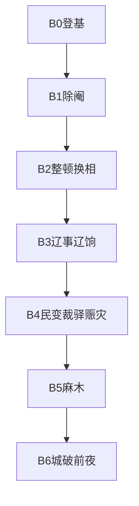

# 第二幕细稿 · 御极「朕即枷锁」

> 气质：《冰汽时代》式残酷；冷青 UI；批红如盖章。

---

## 阶段流程图

---

## B0 · 登基

**场景**：殿柱如树，阴影如囚。阿恩叩首改称王承恩。

> **王承恩**：奴婢王承恩。……从前府里那些话，奴婢再也不敢说了。  
> **你**：……谷种呢？  
> **王承恩**：在。奴婢贴身收着。  
> **旁白**：你学会一个新字：朕。它比「我」重，也比「我」空。

---

## B1 · 魏忠贤案（关键戏）【史】人 + 【戏】对白

**场景**：暖阁。魏忠贤不立刻跪成一团——他先笑。

> **魏忠贤**：皇上要杀奴才，是为天下，还是为那些骂奴才的嘴？  
> **周怀清**（若在场）：妖孽！不诛，何以谢先帝之灵、慰天下之望！  
> **魏忠贤**：先帝若真恨奴才，奴才活不到今日。恨奴才的，是等着分奴才骨头的人。  
> **高算**：……国库空。抄他家，能填一角。  
> **王承恩**（极低）：皇上，杀狗易，喂狗的人还在。

### 三分支后果（叙事）

| 选择 | 短痛快 | 长伤疤 | 回忆标题 |
|---|---|---|---|
| 赐死抄家 | 民心↑ | 清流膨胀/能人恐惧 | 朕杀了魏忠贤 |
| 下狱 | 不彻底 | 两边骂 | 忠贤下狱 |
| 暂留制朝臣 | 秩序短稳 | 士林崩、民心崩 | 朕留了这条狗 |

**除阉次日**【戏】：

> **旁白**：你以为贼去则海清。海没有清。只是换了一批人，来争谁更清。

---

## B2 · 换相空洞

> **马可立**：臣敢任事——敢任「不出事」。  
> **你**：朕要做事的人。  
> **马可立**：做事的人死得快。皇上若常换，剩下的只会更会活。

每次换相：短振作，长「无人敢任事」。君心↑。

---

## B3 · 督师与辽饷 【史】骨架【戏】

> **督师袁某**：五年。不破辽，臣请伏法。  
> **周怀清**：此乃忠言！  
> **高算**：五年的粮饷，从哪张脸上刮？  
> **你**（内心旁白，君心高时）：他若成了，功高难封；他若败了，朕早该疑。

选项：全权 / 监军密察 / 严责 —— 都脏。

辽饷加派后：

> **秋穗式奏报**（文书）：吴中某县，拆屋完税者……  
> **旁白**：你王府里分过的三斗米，盖不住一张加派的黄纸。

---

## B4 · 裁驿（蝴蝶钉）【史】有裁省【民】因果

> **高算**：驿银岁耗巨万。裁之，内帑可喘。  
> **周怀清**：祖制不可轻动！  
> **王承恩**：皇上……驿卒也是人。人散了，会去哪？  
> **你**：去哪？去种地。  
> **旁白**：你说得像王府的道理。国不是王府。

若裁：

> **数旬后林生转邸报**：陕西有驿卒聚众，伪称……（字被墨点污）  
> **你**：疥癣。  
> 或：**你**：派兵。  
> （忽略则 rebel 飙升——逻辑闭环）

---

## B4 · 赈灾三脏

> **开仓**：雨夜，粮袋入泥。你想起第一畦菜。  
> **劝捐**：官绅笑，粮不动。  
> **严剿**：刀影。你硃笔不抖——抖的是承恩的手。

---

## B5 · 麻木样本

> **王承恩**：皇上，歇一息。谷种……  
> **你**：拿开。朕还有折子。  
> （若选听劝）**你**：……还在？  
> **王承恩**：在。

「又撑过一冬」：

> **系统文案**：没有胜利。雪停了。粮或许够到开春。

---

## B6 · 城破前夜 【史】甲申骨架【戏】

> **警报**：流贼逼京。五条资源几乎全红。  
> **你**：批。批。批。  
> **旁白**：烛泪落到未批完的最后一折上。  
> **黑屏**：你倒下时，奏折仍未批完。  
> **转场**：醒来——烟。3D。视角背叛。

---

## 第二幕对白写作公式

1. 先抛「正确 A」  
2. 再抛「正确 B」与 A 互斥  
3. 承恩给「人」的尺度（不是政策）  
4. 旁白点题一句，禁止说教超过一句
