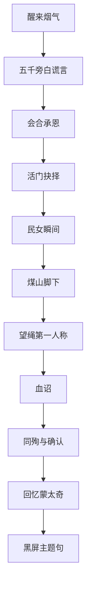

# 第三幕与终章 · 破城 / 煤山 / 回忆

## 结构

---

## 3A · 第三人称短关

### 醒来

> **旁白**：你批折子批到世界尽头。醒来，尽头着火了。

### 「五千」【民】反讽【虚】执行

> **旁白**（旧话腔）：据说，有五千太监护驾。  
> （镜头拉开：十余残卒，甲破，有人在吐。）  
> **王承恩**：奴婢凑得出这些人。……够护送皇上到煤山，不够收复天下。

### 活门

> **校尉**：放民入，乱；封门，他们死在门外。  
> **你**：……  
> （无正确项。只写入回忆。）

### 民女

跑过巷口。哭声。救则费时间；不救则终章可能闪她一眼。

### 煤山脚

> **王承恩**：剩下的路，奴婢陪皇上去。  
> **你**：你怕吗？  
> **王承恩**：怕。怕皇上一个人先走。

---

## 3B · 第一人称煤山 【史】地【民】诏【戏】仪式

**场景**：树。绳。星。UI 清空。

### 望绳

世界音消。心跳。风。闪：菜畦、硃笔、某张脸。

### 血诏

默认：「勿伤我百姓。」  
可选改字级选项（如「勿伤我府中人」——更私，更痛）。

> **王承恩**：皇上写给天下。天下……今晚进不来这片林子。  
> **你**：那写给谁？  
> **王承恩**：写给皇上自己还能相信的那个字。

### 同殉与确认

> **王承恩**：奴婢先走一步。或不——奴婢陪皇上去。  
> （交互：按住。缓慢。非 QTE。）  
> **旁白**：绳很粗。国比绳细。

---

## 3C · 回忆蒙太奇规则（戏剧）

必插优先级：

1. 阿恩初见或夜谈  
2. 登基冷色  
3. **周后园中递巾或劝歇 / 田妃琴歇或空琴囊（至少各抽一类）**  
4. **沈戍×柳筝：灶口糖／断弦／焦墙或空筝囊（高权重）**  
5. 本局最高权重脏手（裁驿 / 杀督师 / 严剿 / 封门）  
6. 周后领旨 / 袁妃剑伤（若已触发）  
7. 血诏句  
8. 最后一镜：日出菜畦 **或** 空畦（若有最后播种）

黑屏后：

> **「再来一局，换一种辜负。」**  
> （禁止「改写天命」）

---

## 主题落地检查

| 问题 | 终章如何回答 |
|---|---|
| 勤政=善治？ | 奏折未完就城破 |
| 杀奸后谁填空？ | 名牌走马灯闪回 |
| 百姓含谁？ | 秋穗/流民/封门外脸 |
| 爱过谁？ | 周后领旨、田妃空琴、袁妃剑伤；沈戍柳筝焦墙 |
| 为何无解？ | 气数条从未归零的系统真相 |
