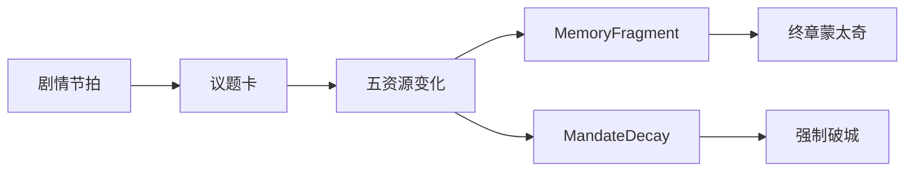

# 玩法 × 叙事咬合

## 设计原则

**每条资源都是一句台词；每次批红都是一场微型道德剧。**



---

## 系统如何服务主题

| 系统 | 主题翻译 |
|---|---|
| 五资源互斥 | 正确与正确互撕 |
| 君心过高 | 勤政成瘾=伤害 |
| MandateDecay 不可清零 | 结构大于个人英雄 |
| 无胜利 UI | 定轨诚实 |
| 回忆碎片 | 玩的是愧疚不是通关 |
| 第一幕经营 | 先给人，再给人变数字 |

---

## 第一幕经营的叙事任务

不是模拟农场赢，而是：

1. 建立「具体的人」（阿恩、秋穗）  
2. 练习取舍（为二幕残酷选择题热身）  
3. 产出 Traits，使二幕台词分叉  
4. 埋谷种母题  

**经营什么**：信王府内院烟火气（菜药鱼 + 私囊铜钱 + 府内人情），不是帝国大盘。  
**为何王爷亲耕**：韬晦、官银私囊分离、知稼穑家训、为日后「事必躬亲」预演 —— 详见 `docs/15_M1经营设计.md`。  
**对标**：星露谷（循环/关系）、灵魂摆渡人（vignette）、冰汽（轻危机）—— 只借骨架，不借矿洞与大城。

---

## 第二幕回合的叙事节奏

```text
看国势（压力）→ 读议题（冲突）→ 批红（伤害）→ 旁白一句（主题）→ 下一旬
```

每 4–6 旬应有一次「承恩劝歇」或「又撑过一冬」，防止纯数值麻木。

---

## 2D 画面下的信息表达

| 元素 | 做法 |
|---|---|
| 资源危险 | 色带黄红软过渡，少用现代霓虹 |
| 议题卡 | 仿奏折；选项如硃批条 |
| 回忆解锁 | 光点/纸纹一小动画 |
| 夜召 | 暖黄纸突然被冷青罩住 |

---

## M1 范围（切片 → 加厚）

**已可玩最小集**：种收卖、NPC、一危机、夜召。  

**加厚目标**（仍一张图）：浅升级、可采植被、2+ 时局 vignette、私囊教程、物价波动。  

完整支柱与不做清单：`docs/15_M1经营设计.md`。对白场次：`04_第一幕剧本.md`。
