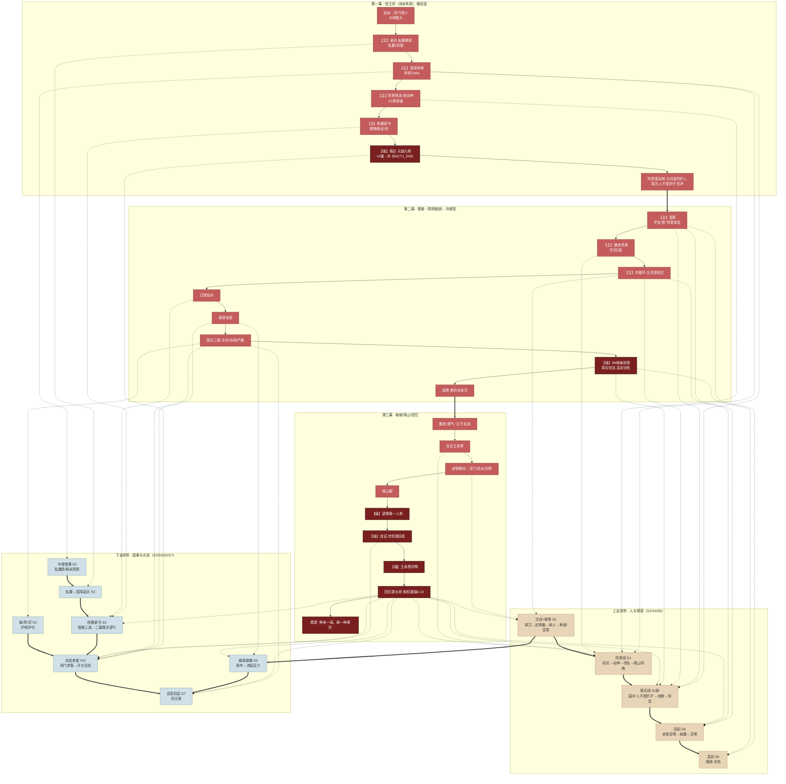
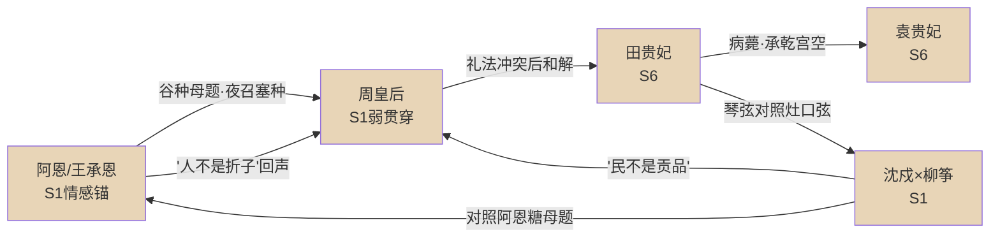
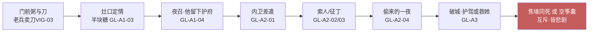
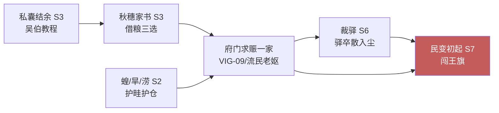
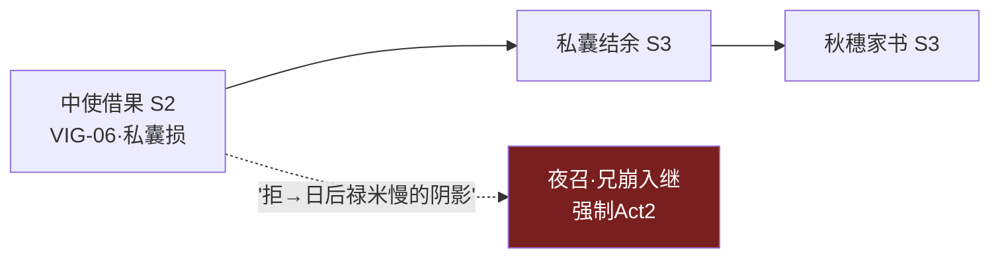
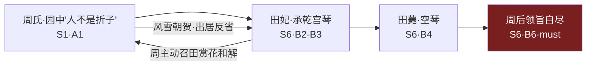
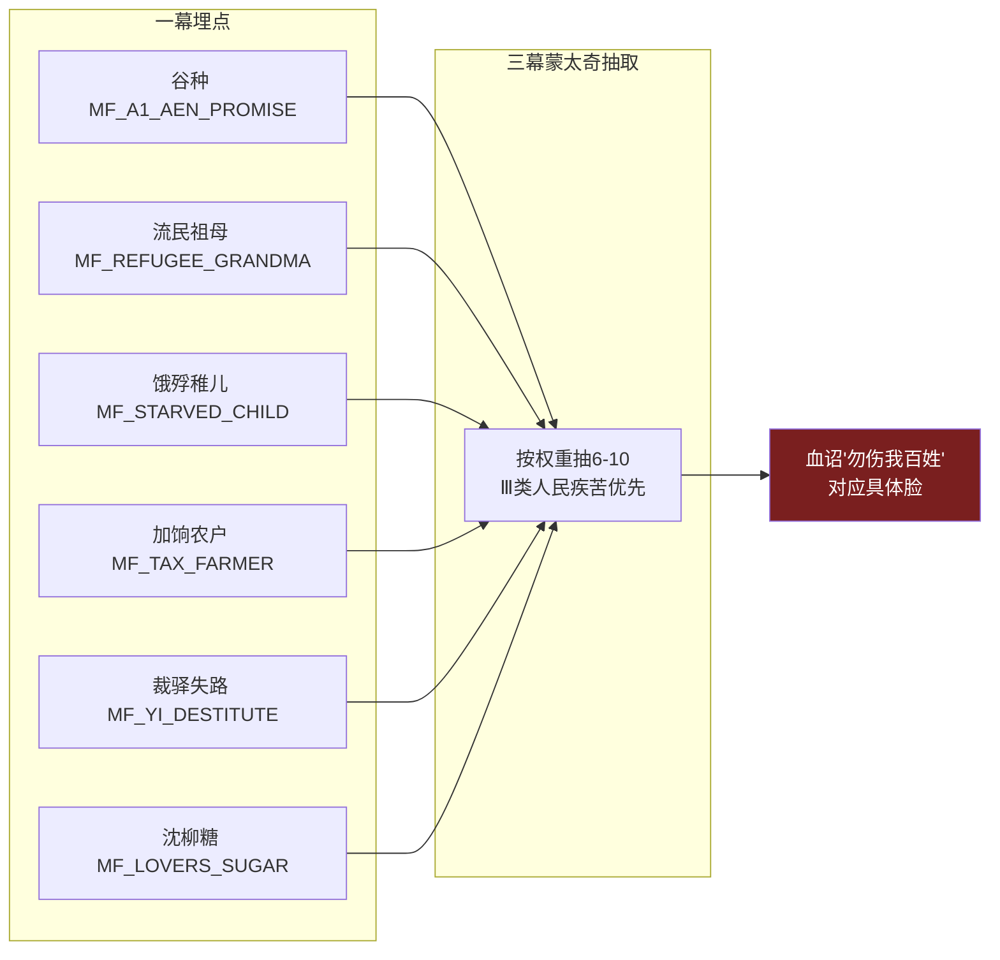

# 《末命》剧情走向总图 · 主线居中 · 支线穿插 · 玩法服务剧情

> 作者：Sakura <1124114910@qq.com>
> 用途：一图看尽所有剧情走向（主线 + 支线 + 支线串联 + 玩法咬合）。
> 阅读方式：本文件含 **1 张大总图**（可缩放）+ **6 张聚焦小图**（支线串联/玩法咬合）。
> 大总图用 Mermaid 绘制，在支持缩放的 Markdown 查看器（或 mermaid.live）中可放大细读。
> 约定：**实线＝主线（不可断）｜虚线＝支线穿插｜点线＝支线之间的串联｜红色＝强制定轨节点｜蓝色＝玩法/系统咬合点**。

> **【主】**＝主线节点（不可断）｜**【强】**＝强制定轨节点（不可被玩法跳过，深红）。

## 代号速查表（读图前必看）

> 图中出现大量缩写，先读此表再看大图。

| 代号 | 含义 | 说明 / 对应剧情 |
|---|---|---|
| **M1 / M2 / M3** | 第一幕 / 第二幕 / 第三幕 | M = Act（幕）。三幕结构：暖经营 → 冷朝堂 → 破城煤山 |
| **A / B / C（节点 ID 字母）** | 仅 Mermaid 节点命名用 | 如 `M1A0`=第一幕第 0 节点、`M2B0`=第二幕第 0 节点、`M3C0`=第三幕第 0 节点。**字母本身无独立剧情含义**，只区分不同幕的节点，请勿当作剧情代号 |
| **B1–B6（正文阶段号）** | 第二幕 6 个主干剧情段落 | 本文档内部简称：B1=魏忠贤案（杀/囚/留）· B2=旬循环·五资源批红 · B3=辽饷加派 · B4=裁驿省银 · B5=赈灾三脏（开仓/劝捐/严剿）· B6=城破前夜（周后领旨·袁妃剑伤）。注：与源稿 `11_剧情总流程.md` 的 B0–B13 编号命名不同，但指向同一剧情 |
| **S1–S7** | 支线跨度等级 | S1=全三幕 · S2=仅一幕收束 · S3=一幕→二幕 · S4=一幕起·二幕隐·三幕显 · S5=仅二幕 · S6=二幕→三幕 · S7=仅三幕。详见本文第三节"支线跨度总表" |
| **VIG** | 支线 vignette 小故事单元 | Vignette 缩写。如 VIG-03 门前粥与刀、VIG-06 中使借果、VIG-09 流民老妪；数字为 vignette 序号 |
| **GL** | 鸳鸯线（沈戍×柳筝）支线编号 | 如 GL-A1-03、GL-A2-01；`A1/A2/A3` 指第一/二/三幕 |
| **MF** | 回忆碎片 Memory Fragment | 如 MF_A1_AEN_PROMISE（谷种）、MF_REFUGEE_GRANDMA（流民祖母）；跨幕回收进终章蒙太奇 |
| **MB** | 主线节点 Mainline Branch | 如 MB01 第一畦菜、MB02 情感锚（阿恩）；来自 `07_玩法叙事咬合.md` |
| **ACT1_END** | 第一幕结束存档点 | 夜召"兄崩入继"后写入，进入第二幕 |
| **（无 AD）** | — | **本文档不含 "AD" 代号**。你可能看的是：① 节点 ID 里的字母（`M1A0`/`M2B0`/`M3C0` 的 A、B）；② 英文 Act（幕）的缩写；③ 阿恩线代号 `AEN`；④ 第一幕议题池 `A1`。若你指的是其中某个或另有出处，告诉我，我单独补标 |

---

# 〇、总览大图（横向 · 主线居中 · 支线上下穿插）

> 三幕自上而下分三条"时间带"，每条带内**从左到右=时间推进**。
> **主线（红色脊骨）居中贯穿三幕**；上方带=偏"人/情感"支线（阿恩·周氏·鸳鸯·后妃），下方带=偏"国/灾/制度"支线（秋穗·私囊·中使·流民·裁驿·辽饷·民变）。

> **图例速读**：红色脊骨＝主线（吴伯→种收→阿恩→秋穗→夜召→登基→除阉→旬循环→辽饷→裁驿→赈灾→城破→煤山→血诏→同殉→蒙太奇）。所有强制定轨节点（夜召、城破、望绳、血诏、同殉、蒙太奇）标深红，不可被玩法跳过。

---

# 一、支线串联聚焦小图（支线 ↔ 支线）

> 以下 6 张小图把"支线之间如何互相牵引"单独抽出来，方便逐条核对因果。

## 1.1 情感四线串联（阿恩 ↔ 周 ↔ 田 ↔ 袁 ↔ 鸳鸯）

## 1.2 鸳鸯线三幕串联（沈戍×柳筝）

## 1.3 国事-灾民串联（私囊→秋穗→流民→裁驿→民变）

## 1.4 中使线串联（借果→禄米阴影→夜召）

## 1.5 后妃内部串联（周↔田礼法冲突→和解→薨→领旨）

## 1.6 回忆回收串联（一幕埋点 → 三幕蒙太奇）

---

# 二、玩法服务剧情标注表（任务 / 道具 / 系统 → 剧情节点）

> 说明：当前**代码仅落地"种收 + 夜召 + 水井/承恩/流民互动"**；下表"玩法任务"列标注了设计意图与落地状态，便于敲定玩法时对照。

## 2.1 第一幕玩法 → 剧情咬合

| 玩法任务 / 道具 | 类型 | 服务的剧情节点 | 落地状态 | 叙事作用 |
|---|---|---|---|---|
| 吴伯私囊教程 | 主线任务 | M1A1 私囊≠官银 | ❌ 未落地 | 教"官银私囊分离"，给 M2 国库初值（S3 桥梁） |
| 菜畦种收（6 块状态机） | 核心循环 | M1A2 + MB01 第一畦菜 | ✅ 已落地 | 建立"具体的人/烟火气"，养成 Traits |
| 阿恩夜谈·收谷种 | 主线任务 | M1A3 + MB02 情感锚 | ❌ 未落地 | 谷种母题（S1），终章回声 |
| 秋穗家书三选 | 主线任务 | M1A4 + S3 | ❌ 未落地 | 仁慈 Traits → M2 开仓台词变软 |
| 水井互动（WellEvent） | 互动点 | MF_A1_WELL_COUGH / 府中人心 | ✅ 已落地 | 民心+1 + 回忆Ⅰ |
| 王承恩随侍 | NPC | 全 S1 锚 | ✅ 已落地 | 情感锚，夜召/煤山同殉 |
| 府门流民老妪 vignette | vignette | MF_A1_REFUGEE_GRANDMA（Ⅲ） | ✅ 已落地 | 人民疾苦钩子 |
| 夜召议题 15 条 | 每周事件 | 前暖后沉弧 + 写回忆 | ✅ 已落地 | **主线承载者**：分段解锁/线性消耗 |
| 最后播种（MF_LAST_SOW） | 后期事件 | 终章空畦/日出对照 | ⚠️ 待接 | 把纯数值经营也绑上剧情 |
| 中使借果 / 周氏园中 / 沈柳 / 护卫棚 | 支线 vignette | S2/S1 多条回忆 | ❌ 未落地 | 20+ 回忆无对应玩法 |

## 2.2 第二幕玩法 → 剧情咬合

| 玩法任务 / 道具 | 类型 | 服务的剧情节点 | 系统后果 |
|---|---|---|---|
| 魏忠贤三分支 | 主线议题 | B1 + 清流/能人后果 | 朝堂结构变 |
| 旬循环·五资源批红 | 核心循环 | B2–B5 全阶段 | 正确互撕，君心↑ |
| 辽饷加派 | 主线议题 | B3 + MF_LIAO_TAX（Ⅲ） | 民心↓，三饷连环 |
| 裁驿 | 主线议题 | B4 + MF_YI_CUT（Ⅲ·must-if） | rebel 永久修正（蝴蝶钉） |
| 赈灾三脏（开仓/劝捐/严剿） | 主线议题 | B4 + MF_OPEN_GRANARY 等 | 高权重脏手回忆 |
| 承恩劝歇 / 又撑过一冬 | 节奏事件 | B5 防麻木 | 君心叙事 |
| 索人/征丁（沈柳） | 支线议题 | GL-A2-02/03 | 耗银耗秩序，鸳鸯裂 |
| 偷来的一夜 | 支线暖场 | GL-A2-04 | 为终章加刀（必出） |
| 后妃穿插（劝歇/琴/礼法/薨） | 支线 | 09_后妃线 | 爱过谁的证据 |

## 2.3 第三幕玩法 → 剧情咬合

| 玩法任务 / 道具 | 类型 | 服务的剧情节点 | 说明 |
|---|---|---|---|
| 活门放/封 | 道德瞬间 | M3C2 + MF_GATE_OPEN/SHUT（Ⅲ） | S7 只改回忆权重 |
| 民女救/弃 | 道德瞬间 | M3C2 + MF_SAVE/LEAVE_GIRL（Ⅲ） | S7 |
| 准/不准沈戍寻柳 | 情感抉择 | M3C2 + MF_LOVERS_WALL/ALONE | 互斥悲剧，不改定轨 |
| 望绳·按住确认 | 交互（非QTE） | M3C4–C6 同殉 | 仪式感 |
| 回忆蒙太奇抽取 | 系统 | M3C7 | 按权重，Ⅲ类优先；血诏对应具体脸 |
| 主题句黑屏 | 系统 | M3C8 | "再来一局，换一种辜负"（禁改天命） |

## 2.4 跨幕系统 → 主题翻译

| 系统机制 | 主题翻译 | 对应剧情 |
|---|---|---|
| 五资源互斥 | 正确与正确互撕 | 二幕每旬批红都是微型道德剧 |
| 君心过高 | 勤政成瘾=伤害 | 周后劝歇常被否→领旨 |
| MandateDecay 不可清零 | 结构大于个人英雄 | 气数触顶强制煤山（定轨） |
| 无胜利 UI | 定轨诚实 | 终章无"中兴通关" |
| 回忆碎片跨幕 | 玩的是愧疚不是通关 | 一幕埋点→三幕蒙太奇 |
| Traits 跨幕 | 选择有疤 | 一幕仁慈→二幕开仓多一句体恤 |

---

# 三、支线跨度总表（谁走多长 · 对照大图分区）

| 跨度 | 含义 | 本作主用线 | 大图位置 |
|---|---|---|---|
| S1 | M1→M2→M3 全长 | 阿恩、气数定轨、沈柳、谷种 | 上带 + 主线 |
| S2 | 仅 M1 收束 | 流民孩、井咳、织妇、蝗旱涝 | 下带 |
| S3 | M1→M2 | 秋穗、林生邸报、私囊→国库 | 下带 |
| S4 | M1 起·M2 隐·M3 显 | 周氏金句、糖/碗对照 | 上带 |
| S5 | 仅 M2 收束 | 单次换相、部分盐法/密报 | 主线 B2 |
| S6 | M2→M3 | 田薨、袁妃剑、周后领旨、裁驿蝴蝶 | 上带 + 下带 |
| S7 | 仅 M3 | 活门、民女 | 下带·终章 |

> **硬规则**：S2/S5/S7 允许玩家错过，不挡夜召/破城/煤山；S1 不超过 4 条防止主线被情感线撑爆。

---

# 四、一句话验收（看此图应能复述）

> 王府烟火与取舍（上带人·下带国）→ 夜召称孤（定轨钉）→ 除阉后越勤越乱（正确互撕）→ 后妃与小人物都被碾碎（上带收束）→ 煤山定轨（深红强制）；支线只改变你辜负过谁的证据（下带人民疾苦优先入蒙太奇），不改变绳。

— 作者：Sakura <1124114910@qq.com>
