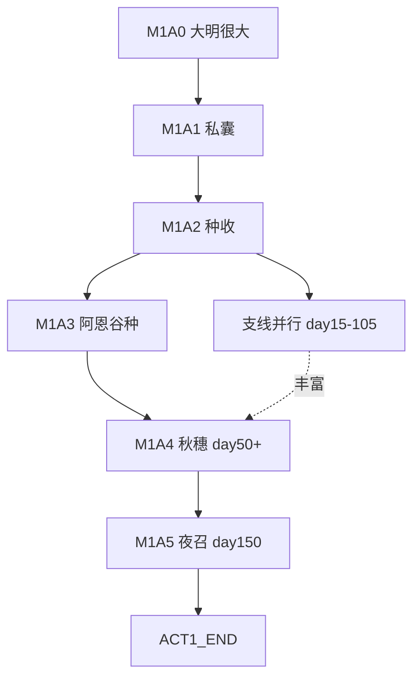

# 剧情连贯性审查与优化（2026-08-24）

> 本次对最新 `game/` 工程与 `docs/story/` 做对照审计，并落地一批文档+代码修复。  
> 冻结稿：[`archive/story/story_0.0.6.md`](../../archive/story/story_0.0.6.md)

---

## 一、发现的主要问题（审计前）

| # | 问题 | 影响 |
|---|---|---|
| 1 | **M1A5 仅有统计画面**，无夜召入继演出 | 主线情感断档；与 `04_第一幕剧本` 不符 |
| 2 | **M1A0 缺核心句**「大明很大。府门很小。」 | 主题定位弱 |
| 3 | **M1A4 可与 M1A3 脱序**（day50 即触发） | 「未种先赈」不合理 |
| 4 | **回忆 ID 文档/代码漂移** | 终章抽卡、策划对表困难 |
| 5 | **`08_时局小故事` 过度标注 ✅** | 2D 有、3D 无的内容被标为已落地 |
| 6 | **`09_M1经营设计` §4d 陈旧** | 写「6 条循环」与 §4b 15 条线性矛盾 |
| 7 | **秋穗回忆柱**代码写 Ⅰ，文档写 Ⅲ | 蒙太奇权重策略不一致 |
| 8 | **`02_故事圣经` 空壳** | 接手成本高 |

---

## 二、已落地修复（代码）

| 项 | 文件 | 改动 |
|---|---|---|
| M1A5 演出 | `AccessionEvent.gd`（新） | 条件台词（周氏/沈戍/秋穗）→ `MF_A1_NIGHT_SUMMON` |
| 两段收束 | `Act1Director.gd` | day150：入继 → Closure；环境暖→冷 |
| M1A0 | `Act1Director._show_intro` | 增加「大明很大。府门很小。」 |
| M1A4 门控 | `Act1Director._qiushui_prereq_met` | 须谷种/首畦 |
| 秋穗 | `QiuShuiLetterEvent.gd` | Ⅲ 柱 + 私囊教程回扣文案 |
| 鸳鸯 | `ShenLiuStoryline.gd` | 糖记忆 w9；b3 回扣「成亲留到太平」 |
| 收束文案 | `Act1Closure.gd` | 衔接入继后语感 |

---

## 三、回忆碎片 ID 对照表（文档 ↔ 代码）

> 规则：**以代码为准**；文档保留别名时在「文档 ID」列标注。

| 文档 ID | 代码 ID | 场景 | 柱 |
|---|---|---|---|
| MF_A1_PURSE_LESSON | `MF_A1_PURSE_TUTORIAL` | M1A1 | Ⅱ |
| MF_A1_ZHOU_GARDEN | `MF_A1_ZHOU_NOT_MEMORIAL` | 周氏 | Ⅰ |
| MF_A1_LOVERS_SUGAR | `MF_LOVERS_SUGAR` | 沈柳 b2 | Ⅰ |
| MF_A1_WELL_COUGH | `MF_A1_WELL` | 井 | Ⅲ |
| MF_A1_EUNUCH_BORROW | `MF_A1_EUNUCH_FRUIT` | 中使 | Ⅲ |
| MF_A1_HELP_QIUSHUI | `MF_A1_QIUSHUI_LEND` | 秋穗 | Ⅲ |
| MF_A1_REFUSE_QIUSHUI | `MF_A1_QIUSHUI_REFUSE` | 秋穗 | Ⅲ |
| MF_A1_NIGHT_SUMMON | `MF_A1_NIGHT_SUMMON` | M1A5 | Ⅰ |
| MF_A1_REFUGEE_GRANDMA | `MF_A1_VIGNETTE_*` | 流民 | Ⅲ |

**仅文档、待落地**：`MF_A1_SUNRISE`、`MF_A1_AEN_FIRST`、`MF_A1_GATE_CHILD`、`MF_A1_OLD_SOLDIER`、`MF_A1_GAZETTE`、`MF_A1_AEN_SUGAR`、`MF_A1_SHARE_KITCHEN` 等（见 `08_时局小故事.md`）。

---

## 四、主线连贯性（优化后）

**硬门控**：A4 ← A3；A5 不可跳过。  
**软并行**：周氏/沈柳/中使/天灾不挡 A4/A5，但 M1A5 台词会读取其旗标。

---

## 五、支线流畅性

| 链 | 逻辑 | 状态 |
|---|---|---|
| 私囊→秋穗 | M1A1 教「私/公」→ M1A4 文案回扣 | ✅ |
| 种→谷种→秋穗 | 先种再赈 | ✅ 门控 |
| 沈柳 b1→b2→b3 | day 递增 | ✅ |
| 沈柳 b3→M1A5 | 入继夜交叉台词 | ✅ |
| 周氏→M1A5 | 阿恩复述「人不是折子」 | ✅ |
| 中使→M2 | `eunuch_refused` 阴影 | ✅ 旗标；M2 台词待写 |
| 仁慈→M2 | `kind_likely` | ✅ 旗标；M2 台词待写 |

---

## 六、玩法深度建议（后续迭代）

1. **目标条优先级**：薄暮前提示「与阿恩/秋穗相关的未完主线」  
2. **3D 府门经济链**：首获→售卖→访客（孩子/兵/织妇/赈）— 2D 切片已有逻辑可迁  
3. **M1A0 初见阿恩**：PRO-02 短对话 + `MF_A1_AEN_FIRST`（可选 must）  
4. **入继前夜议题**与 **M1A5** 互文：若 day145 已玩 `ISSUE_A1_EVE_OF_ACCESSION`，M1A5 多一句誓  
5. **第二幕开仓台词表**：按 `kind_likely` / `eunuch_refused` / `lovers_sugar` 三分支预写

---

## 七、验收清单

- [x] 读 `04_第一幕剧本` 能对照代码找到每个节点  
- [x] day150 先看到夜召对白，再看到统计屏  
- [x] 未播种时 day50 不弹秋穗  
- [x] 秋穗回忆进入 Ⅲ 池  
- [ ] 3D 府门 vignette 全接（下一里程碑）

— 作者：Sakura <1124114910@qq.com>
